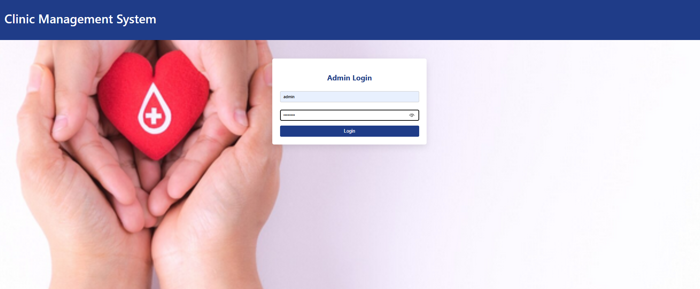
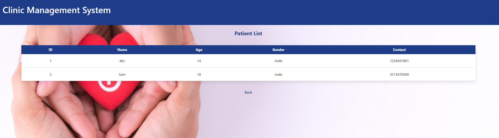

# Clinic Management Web Application

Designed and developed a web-based hospital management system to digitize patient records and streamline appointment scheduling for small clinics using a secure, role-based backend architecture.

## Tech Stack
- Frontend: HTML, CSS
- Backend: Python (Flask)
- Database: MySQL

## How to Run Locally
1. Clone the repository  
2. Create and activate a virtual environment  
3. Install dependencies: `pip install flask mysql-connector-python`  
4. Configure MySQL credentials in `db.py`  
5. Run the app: `python app.py`  
6. Open `http://127.0.0.1:5000/` in your browser

## Screenshots

### Login Page

### Dashboard

### Patient List

